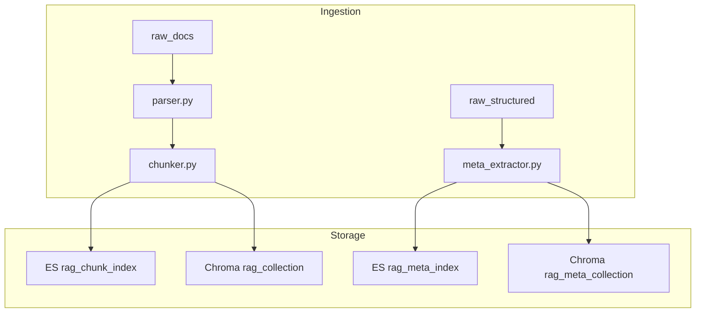
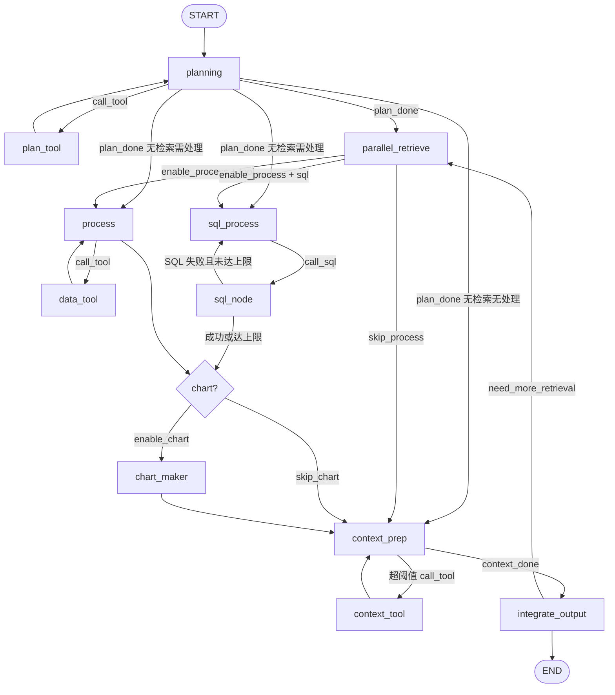
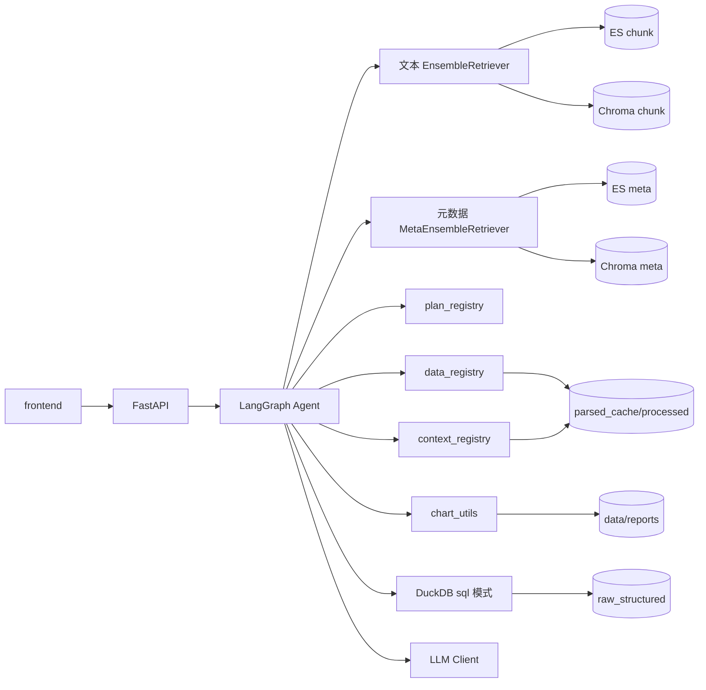

# Knowledge RAG System Agent

企业知识库问答系统，采用 **双轨 RAG 架构**：文本知识库（PDF/Word/TXT chunk + ES/BM25/Dense 三路混合检索）与结构化知识库（CSV/XLSX/Parquet 等 **仅元数据入库** + 关键词/向量双路检索）。上层基于 LangGraph 构建 **多阶段 Agent 流水线**（规划 → 双轨并行检索 → **双模式数据处理** → 异步绘图 → **上下文压缩** → 整合输出），支持 `tool` / `sql` 两种结构化处理方式、处理产物落盘（state 仅存 path+preview）、整合前分层压缩与补充检索循环。

---

## 功能概览


| 模块         | 能力                                                                                                       |
| ---------- | -------------------------------------------------------------------------------------------------------- |
| **双轨入库**   | 文本：解析 → 滑窗切块 → ES + Chroma；结构化：**仅提取表头/字段/路径等元数据** → ES meta + Chroma meta；MD5 增量 + 软删除                  |
| **文本混合检索** | ES 全文、BM25、Dense 三路 async 并行召回，加权融合 + Reranker 精排；`ENABLE_ES/BM25/DENSE` 消融                              |
| **元数据检索**  | MetaKeyword + MetaDense 双路融合，返回 `ScoredMetaRecord`（含 **file_path**）；运行时按需读行或 SQL                         |
| **知识库问答**  | `/search`：Agent 生成答案；规划阶段识别 `data_process_mode`（none/tool/sql）；支持补充检索                                    |
| **结构化处理**  | **tool 模式**：`process` ↔ `data_tool` 逐步调用内置工具；**sql 模式**：`sql_process` ↔ `sql_node` DuckDB 只读 SELECT，失败重试 |
| **上下文管理**  | 整合输出前 `context_prep` ↔ `context_tool`：超阈值时分片/摘要/截断/分层压缩，再送入 LLM                                          |
| **报告与图表**  | `/report`：Markdown 报告 + 表格/折线/柱状图；`GET /report/{session_id}/download` 下载                                 |
| **评测体系**   | `gen_testset.py` 自动生成测试集；`rag_metric_eval.py` 批量消融对比 Recall@K 等                                          |
| **实时监听**   | Watchdog 监听 `raw_docs` + `raw_structured`，防抖后触发增量入库                                                      |


### 双轨数据流


| 数据类型       | 格式                                      | 入库                 | 检索                         | Agent 后续                                                            |
| ---------- | --------------------------------------- | ------------------ | -------------------------- | ------------------------------------------------------------------- |
| **文本知识库**  | pdf/doc/docx/txt                        | 正文解析 → chunk       | ES + BM25 + Dense + rerank | `retrieve_knowledge` → `ScoredChunk`                                |
| **结构化知识库** | csv/tsv/xlsx/xlsb/parquet/feather/jsonl | **仅元数据**（表名/表头/路径） | keyword + dense 融合         | `retrieve_data` → 文件路径 → **tool** 或 **sql** 处理 → `ProcessedDataRef` |


---

## 目录结构

```
Knowledge_Rag_System_Agent/
├── .cursorrules                  # 全局编码规约（分层、风格、开发顺序）
├── docker-compose.yml            # ES + Redis 一键部署
├── .env.example                  # 双轨路径、双索引、检索开关与权重
├── pyproject.toml                # Poetry 依赖（含 pandas/duckdb/matplotlib）
├── README.md
├── frontend/
│   └── index.html                # 简易问答/报告模式前端
├── eval/
│   ├── __init__.py
│   ├── gen_testset.py            # 遍历 raw_docs，LLM 生成测试集 JSON
│   ├── rag_metric_eval.py        # 批量切换文本检索配置，输出 Recall@K 等指标
│   └── test_result/              # 测试集与消融指标报表
├── scripts/
│   ├── __init__.py
│   ├── monitor.py                # watchdog 监听 raw_docs + raw_structured
│   ├── check_es_health.py        # ES 连通性诊断（TCP/HTTP）
│   └── check_docker_registry.py  # Docker Hub / Elastic  registry 连通性诊断
├── app/
│   ├── __init__.py
│   ├── main.py                   # FastAPI 入口；startup sync_all；挂载路由
│   ├── dependencies.py           # AppContainer：ES/向量/双轨检索/LLM/三注册表/Agent 图
│   ├── config/
│   │   ├── __init__.py
│   │   ├── settings.py           # Pydantic Settings：路径/LLM/双索引/双轨检索开关
│   │   └── paths.py              # PathManager 跨平台路径规范化
│   ├── api/
│   │   ├── __init__.py           # 聚合 /documents /search /report
│   │   ├── doc_api.py            # 上传、全量 sync（/documents/*）
│   │   ├── search_api.py         # 知识库问答（report_mode 可选）
│   │   └── report_api.py         # 报告生成 + GET .../download
│   ├── schemas/
│   │   ├── __init__.py           # lazy exports
│   │   ├── document.py           # DocChunk、AssetKind、ScoredChunk
│   │   ├── structured.py         # MetaRecord、DataProcessMode、ProcessedDataRef、ContextBundle
│   │   ├── query.py              # SearchRequest/Response、ReportRequest/Response
│   │   └── metrics.py            # EvalMetrics
│   ├── common/
│   │   ├── __init__.py
│   │   └── logger.py             # loguru 分级滚动日志
│   ├── core/
│   │   ├── __init__.py
│   │   ├── ingestion/
│   │   │   ├── __init__.py
│   │   │   ├── parser.py         # PDF/DOCX/TXT 正文解析
│   │   │   ├── chunker.py        # 滑窗切块 → DocChunk
│   │   │   ├── meta_extractor.py # 结构化文件元数据提取（不读全表）
│   │   │   └── updater.py        # 按扩展名分流 text/structured；sync_all
│   │   ├── retrieval/
│   │   │   ├── __init__.py
│   │   │   ├── base.py           # 文本检索抽象基类
│   │   │   ├── es_retriever.py
│   │   │   ├── bm25_retriever.py
│   │   │   ├── dense_retriever.py
│   │   │   ├── reranker.py
│   │   │   ├── ensemble.py       # 文本三路融合 + 精排
│   │   │   ├── meta_keyword_retriever.py
│   │   │   ├── meta_dense_retriever.py
│   │   │   └── meta_ensemble.py  # 元数据双路融合
│   │   ├── agent/
│   │   │   ├── __init__.py
│   │   │   ├── state.py          # AgentState（含 data_process_mode / ProcessedDataRef / ContextBundle）
│   │   │   ├── nodes/            # 每节点单文件 + debug_*；_helpers/_routes/_debug_runtime
│   │   │   │   ├── planning.py / plan_tool.py
│   │   │   │   ├── parallel_retrieve.py（内嵌 retrieve_knowledge / retrieve_data）
│   │   │   │   ├── process.py / data_tool.py      # tool 模式数据处理循环
│   │   │   │   ├── sql_process.py / sql_node.py   # sql 模式 DuckDB 查询循环
│   │   │   │   ├── context_prep.py / context_tool.py  # 整合前上下文压缩循环
│   │   │   │   ├── chart_maker.py / integrate_output.py
│   │   │   │   └── _routes.py / _helpers.py
│   │   │   ├── graph.py          # LangGraph 条件边编译
│   │   │   ├── chart_utils.py    # matplotlib 表格/折线/柱状图
│   │   │   └── runner.py         # run_agent() 封装
│   │   └── tools/
│   │       ├── __init__.py
│   │       ├── base_tool.py
│   │       ├── registry.py       # plan_registry + data_registry + context_registry
│   │       ├── structured_ops.py # read_table / filter / aggregate / execute_sql_on_file
│   │       ├── artifact_utils.py # 处理产物落盘；state 仅存 path+preview
│   │       └── builtin/
│   │           ├── __init__.py
│   │           ├── plan_tool.py            # 规划阶段：date_calc 等
│   │           ├── structured_read_tool.py
│   │           ├── data_ops_tools.py       # data_filter / data_aggregate
│   │           └── context_tools.py        # 截断/分片/摘要/分层压缩/合并
│   └── infrastructure/
│       ├── __init__.py
│       ├── es_client.py          # 双索引：rag_chunk_index + rag_meta_index
│       ├── vector_client.py      # 双 collection：rag_collection + rag_meta_collection
│       ├── llm_client.py
│       └── embedding_service.py  # bge-m3 + bge-reranker
├── data/
│   ├── raw_docs/                 # 文本源文件
│   ├── raw_structured/           # 结构化源文件（csv/xlsx/parquet 等）
│   ├── parsed_cache/             # 解析缓存 + session 处理/SQL/上下文压缩产物
│   ├── persist_db/               # Chroma 持久化（双 collection）
│   └── reports/                  # 报告与图表（按 session_id）
└── logs/
```

---

## 技术栈与版本


| 类别        | 选型                                                | 版本                                          |
| --------- | ------------------------------------------------- | ------------------------------------------- |
| 运行时       | Python                                            | >=3.11,<3.13（推荐 3.11.x）                     |
| Web       | FastAPI + Uvicorn                                 | 0.109.2 / 0.27.1                            |
| 配置        | Pydantic Settings                                 | 2.7.4 / 2.4.0                               |
| Agent     | LangGraph + LangChain                             | 0.2.27 / 0.2.10                             |
| 检索        | Elasticsearch + ChromaDB                          | 8.13.0 / 0.5.4                              |
| Embedding | sentence-transformers + torch                     | 3.3.1 / 2.2.2                               |
| 文档解析      | unstructured + docling + pypdf + python-docx      | 0.16.5 / 0.2.0 / 4.2.0 / 1.2.0              |
| 结构化数据     | pandas + pyarrow + openpyxl + pyxlsb + **duckdb** | 2.2.3 / 17.0.0 / 3.1.5 / 1.0.10 / **1.1.3** |
| 图表        | matplotlib                                        | 3.9.4                                       |
| 评测        | RAGAS                                             | 0.1.10                                      |
| 缓存        | Redis（可选）                                         | 5.2.1 / Docker 7.2-alpine                   |
| 基础设施      | Docker ES 镜像                                      | 8.13.0                                      |


---

## 依赖对齐检查

已对 `pyproject.toml`、`.env.example`、`docker-compose.yml` 三处交叉核对；pip dry-run（Python 3.12）全量依赖解析 **通过**。

### 已对齐（无冲突）


| 检查项         | pyproject                                      | docker-compose                  | .env.example                                                |
| ----------- | ---------------------------------------------- | ------------------------------- | ----------------------------------------------------------- |
| ES 服务端版本    | `elasticsearch==8.13.0`                        | 镜像 `8.13.0`                     | —                                                           |
| ES 连接地址     | —                                              | 端口 `9200`                       | `ES_HOST=http://127.0.0.1:9200`                             |
| ES 认证       | 客户端 8.x 支持 Basic Auth                          | `ELASTIC_PASSWORD=elastic123`   | `ES_USER=elastic` / `ES_PASSWORD=elastic123`                |
| ES 索引名      | —                                              | —                               | `ES_INDEX_NAME` + `ES_META_INDEX_NAME`                      |
| Chroma 集合   | `chromadb==0.5.4`                              | —                               | `CHROMA_COLLECTION` + `CHROMA_META_COLLECTION`              |
| 向量持久路径      | —                                              | —                               | `VECTOR_PERSIST_PATH=./data/persist_db`                     |
| Redis 缓存    | `redis==5.2.1`                                 | 镜像 `redis:7.2-alpine` 端口 `6379` | `ENABLE_REDIS=false` / `REDIS_URL`                          |
| 消融开关        | —                                              | —                               | 文本轨 `ENABLE_ES/BM25/DENSE`；元数据轨 `ENABLE_META_KEYWORD/DENSE` |
| 融合权重        | —                                              | —                               | `ES_WEIGHT=0.3` / `BM25_WEIGHT=0.2` / `DENSE_WEIGHT=0.5`    |
| 召回参数        | —                                              | —                               | `BASE_TOP_K=20` / `FINAL_TOP_K=10`                          |
| Agent 栈     | langgraph + langchain + langchain-openai       | —                               | LLM 走 OpenAI 兼容 API                                         |
| 评测          | ragas 0.1.10                                   | —                               | 与 langchain 0.2.x 可共存                                       |
| docling 解析链 | `docling==0.2.0`                               | —                               | —                                                           |
| pydantic 链  | `pydantic==2.7.4` + `pydantic-settings==2.4.0` | —                               | 满足 docling `>=2.3.0` 要求                                     |
| torch 版本    | `torch==2.2.2`                                 | —                               | 满足 docling-ibm-models 固定依赖                                  |


### 联动修正说明（保留 docling 0.2.0 的必要调整）


| 原值                         | 修正值                        | 原因                                                   |
| -------------------------- | -------------------------- | ---------------------------------------------------- |
| `docling==0.2.10`          | `docling==0.2.0`           | PyPI 无 0.2.10 版本                                     |
| `python-docx==1.2.4`       | `python-docx==1.2.0`       | PyPI 最新为 1.2.0                                       |
| `pydantic==2.6.1`          | `pydantic==2.7.4`          | docling 要求 pydantic-settings≥2.3.0，后者依赖 pydantic≥2.7 |
| `pydantic-settings==2.2.1` | `pydantic-settings==2.4.0` | 满足 docling 最低版本要求                                    |
| `torch==2.4.1`             | `torch==2.2.2`             | docling-ibm-models 0.2.0 固定依赖 torch 2.2.2            |


### 注意事项


| 项              | 说明                                                                                |
| -------------- | --------------------------------------------------------------------------------- |
| **首次模型下载**     | `BAAI/bge-m3`、`BAAI/bge-reranker-v2-m3` 体积较大，首次启动需联网                              |
| **GPU 环境**     | `.env` 中 `DEVICE=cuda`；torch 2.2.2 需匹配 CUDA 版本                                    |
| **Redis 默认关闭** | `ENABLE_REDIS=false`；需要时再 `docker compose --profile redis up -d`（需能访问 Docker Hub） |
| **docling 平台** | 官方主要测试 macOS/Linux；Windows 需自行验证 PDF 解析                                           |


---

## 实现状态


| 类别         | 说明                                                                                                                                       | 状态    |
| ---------- | ---------------------------------------------------------------------------------------------------------------------------------------- | ----- |
| 双轨 Schema  | `document.py` + `structured.py` + `query.py`                                                                                             | ✅ 已实现 |
| 配置与路径      | `settings.py` + `paths.py`，覆盖双轨 env 变量                                                                                                   | ✅ 已实现 |
| 双轨入库       | `parser` / `chunker` / `meta_extractor` / `updater`                                                                                      | ✅ 已实现 |
| 双轨检索       | 文本 ensemble + meta ensemble                                                                                                              | ✅ 已实现 |
| Agent 十二节点 | planning↔plan_tool；parallel_retrieve；process↔data_tool **或** sql_process↔sql_node；context_prep↔context_tool；chart_maker；integrate_output | ✅ 已实现 |
| API        | `/documents` `/search` `/report` + 报告下载                                                                                                  | ✅ 已实现 |
| 运维与评测      | `monitor.py` + `eval/`* + `frontend/index.html`                                                                                          | ✅ 已实现 |


---

## 模块实现清单

按 plan 自底向上已全部落地，联调顺序如下：

```
Phase 1  基础层     config/settings + paths · logger · schemas（document/structured/query/metrics）
Phase 2  基础设施   es_client（双索引）· vector_client（双 collection）· llm_client · embedding_service
Phase 3  双轨入库   parser · chunker · meta_extractor · updater（sync_all 扫描双目录）
Phase 4  双轨检索   文本 es/bm25/dense/ensemble + 元数据 meta_keyword/meta_dense/meta_ensemble
Phase 5  工具与图表 base_tool · registry（三注册表）· structured_ops · artifact_utils · builtin/* · chart_utils
Phase 6  Agent     state · nodes（十二节点）· graph · runner
Phase 7  API 入口  dependencies · doc/search/report_api · main
Phase 8  运维评测   monitor.py · eval/* · frontend/index.html
```

**联调验收要点：**

- 放入 `data/raw_docs/` 与 `data/raw_structured/` 样例文件，`sync_all` 后 ES/Chroma 双索引均有数据
- `/search` 文本问答；带表格/统计关键词触发结构化检索与 **tool** 处理；复杂聚合/条件查询可走 **sql** 模式
- 处理产物写入 `parsed_cache/{session_id}/processed/`，state 仅保留 `ProcessedDataRef(path, preview)`
- 中间数据超 `CONTEXT_SIZE_THRESHOLD_CHARS` 时，整合前自动走 context 压缩 tool 循环
- `/report` 生成 Markdown，`GET /report/{session_id}/download` 可下载
- 切换 `ENABLE_`* 运行 `rag_metric_eval.py` 对比消融指标

---

## 部署指引

### 1. 环境准备

- **Python 3.11+**（推荐 3.11.x；3.12 已通过 dry-run 验证）
- [Poetry](https://python-poetry.org/) 包管理
- Docker Desktop（用于 Elasticsearch）

### 2. 安装依赖

```bash
poetry install
```

### 3. 配置环境变量

```bash
cp .env.example .env
# 编辑 .env：至少填写 LLM_API_KEY，按需调整 ES 密码与模型路径
```

主要配置项说明（与 `.env.example` 一致）：


| 变量                                           | 说明                                   | 默认值                                  |
| -------------------------------------------- | ------------------------------------ | ------------------------------------ |
| `APP_ENV` / `APP_HOST` / `APP_PORT`          | 运行环境与监听地址                            | `dev` / `0.0.0.0` / `8000`           |
| `LOG_LEVEL` / `LOG_DIR`                      | 日志级别与归档目录                            | `INFO` / `./logs`                    |
| `RAW_DOC_PATH`                               | 原始文档目录                               | `./data/raw_docs`                    |
| `RAW_STRUCTURED_PATH`                        | 结构化源文件目录                             | `./data/raw_structured`              |
| `REPORT_OUTPUT_PATH`                         | 报告与图表输出                              | `./data/reports`                     |
| `CACHE_PATH`                                 | 解析缓存目录                               | `./data/parsed_cache`                |
| `VECTOR_PERSIST_PATH`                        | Chroma 持久化路径                         | `./data/persist_db`                  |
| `EVAL_RESULT_PATH`                           | 评测结果输出目录                             | `./eval/test_result`                 |
| `LLM_BASE_URL` / `LLM_API_KEY` / `LLM_MODEL` | LLM 端点与凭证                            | DeepSeek 兼容 API                      |
| `LLM_TEMPERATURE`                            | 生成温度                                 | `0.1`                                |
| `EMBED_MODEL_NAME`                           | Embedding 模型                         | `BAAI/bge-m3`                        |
| `RERANK_MODEL_NAME`                          | Rerank 模型                            | `BAAI/bge-reranker-v2-m3`            |
| `DEVICE`                                     | 推理设备                                 | `cpu`（GPU 填 `cuda`）                  |
| `CHUNK_SIZE` / `CHUNK_OVERLAP`               | 切块大小与重叠                              | `512` / `64`                         |
| `ES_HOST` / `ES_USER` / `ES_PASSWORD`        | ES 连接与认证                             | 对齐 docker-compose                    |
| `ES_INDEX_NAME`                              | ES 文本 chunk 索引                       | `rag_chunk_index`                    |
| `ES_META_INDEX_NAME`                         | ES 结构化元数据索引                          | `rag_meta_index`                     |
| `CHROMA_COLLECTION`                          | Chroma 文本向量集合                        | `rag_collection`                     |
| `CHROMA_META_COLLECTION`                     | Chroma 元数据向量集合                       | `rag_meta_collection`                |
| `ENABLE_META_KEYWORD` / `ENABLE_META_DENSE`  | 元数据轨双路开关                             | 均为 `true`                            |
| `META_KEYWORD_WEIGHT` / `META_DENSE_WEIGHT`  | 元数据融合权重                              | `0.4` / `0.6`                        |
| `MAX_RETRIEVAL_ROUNDS`                       | integrate_output 补充检索轮次上限            | `3`                                  |
| `MAX_PLAN_TOOL_STEPS`                        | planning ↔ plan_tool 多步规划上限          | `3`                                  |
| `MAX_PROCESS_TOOL_STEPS`                     | process ↔ data_tool 多步数据处理上限         | `5`                                  |
| `MAX_SQL_RETRIES`                            | sql_process ↔ sql_node SQL 生成/执行重试上限 | `3`                                  |
| `MAX_CONTEXT_TOOL_STEPS`                     | context_prep ↔ context_tool 上下文压缩上限  | `5`                                  |
| `CONTEXT_SIZE_THRESHOLD_CHARS`               | 触发上下文压缩的字符数阈值                        | `12000`                              |
| `PROCESSED_DATA_PREVIEW_ROWS`                | 处理产物 preview 行数                      | `5`                                  |
| `STRUCTURED_QUERY_MAX_ROWS`                  | 结构化读表/SQL 结果行数上限                     | `5000`                               |
| `CHART_TASK_TIMEOUT_SEC`                     | 异步绘图任务超时（秒）                          | `120`                                |
| `ENABLE_REDIS` / `REDIS_URL`                 | Redis 缓存开关与地址                        | `false` / `redis://127.0.0.1:6379/0` |
| `CORS_ORIGINS`                               | 前端跨域白名单                              | 本地 5500 端口                           |
| `ENABLE_ES` / `ENABLE_BM25` / `ENABLE_DENSE` | 三路检索消融开关                             | 均为 `true`                            |
| `ES_WEIGHT` / `BM25_WEIGHT` / `DENSE_WEIGHT` | 融合权重                                 | `0.3` / `0.2` / `0.5`                |
| `BASE_TOP_K` / `FINAL_TOP_K`                 | 各路召回数 / 精排保留数                        | `20` / `10`                          |


### 4. 启动基础设施（Elasticsearch）

```bash
# 默认仅启动 ES（不拉取 Docker Hub 上的 redis，适合国内网络）
docker compose up -d

# 可选：需要 Redis 缓存且网络可访问 Docker Hub 时
docker compose --profile redis up -d

docker compose ps
# 验证 ES：curl -u elastic:elastic123 http://127.0.0.1:9200
```

若 `docker compose up -d` 报 **registry-1.docker.io** 连接超时，通常是 Docker Hub 不可达（IPv6/网络问题）。本项目建库 **只需 ES**（镜像来自 `docker.elastic.co`），无需 Redis。可运行诊断：

```bash
python scripts/check_docker_registry.py
```

`docker-compose.yml` 包含：

- **Elasticsearch 8.13.0**（默认启动）：启用 `xpack.security`，用户 `elastic`，密码 `elastic123`
- **Redis 7.2-alpine**（`--profile redis` 可选）：端口 `6379`，与 `.env` 中 `REDIS_URL` 对齐

### 5. 启动服务

```bash
# API 服务（启动时自动执行 sync_all 全量入库兜底）
poetry run uvicorn app.main:app --reload --host 0.0.0.0 --port 8000

# 可选：监听 raw_docs + raw_structured 增量入库
poetry run python scripts/monitor.py
```

### 6. 访问前端

浏览器打开 `frontend/index.html`，或通过静态文件服务访问；API 文档见 `http://localhost:8000/docs`。

### 7. 文档入库

- **自动**：将文件放入 `data/raw_docs/` 或 `data/raw_structured/`，由 `monitor.py` 或 API 启动时的 `sync_all` 处理
- **手动**：调用 `/documents/upload`、`/documents/sync` 等接口

---

## 消融测试

系统支持通过 `.env` 开关与权重，在不改代码的情况下对比不同检索组合。

### 文本轨消融（`rag_metric_eval.py` 内置方案）


| 方案      | ENABLE_ES | ENABLE_BM25 | ENABLE_DENSE | 说明             |
| ------- | --------- | ----------- | ------------ | -------------- |
| 全路混合    | true      | true        | true         | 默认配置           |
| 仅 ES    | true      | false       | false        | 验证 ES 全文检索贡献   |
| 仅 BM25  | false     | true        | false        | 验证 BM25 稀疏检索贡献 |
| 仅 Dense | false     | false       | true         | 验证向量语义检索贡献     |


### 元数据轨消融


| 方案   | ENABLE_META_KEYWORD | ENABLE_META_DENSE | 说明       |
| ---- | ------------------- | ----------------- | -------- |
| 双路融合 | true                | true              | 默认       |
| 仅关键词 | true                | false             | 表名/字段名匹配 |
| 仅向量  | false               | true              | 元数据语义检索  |


权重：`META_KEYWORD_WEIGHT` + `META_DENSE_WEIGHT` 建议和为 `1.0`。

### 操作步骤

1. 修改 `.env` 中 `ENABLE`_* 与 `ES_WEIGHT` / `BM25_WEIGHT` / `DENSE_WEIGHT`
2. 重启 API 服务使配置生效
3. 运行评测脚本（见下文）或手动调用 `/search` 接口对比结果
4. 指标报表输出至 `eval/test_result/`

> 权重之和建议为 `1.0`；关闭某支路时对应权重可置 `0` 或保持原值（`ensemble` 应跳过未启用支路）。

---

## 评测集生成与指标测算

### 生成测试集

将待评测原始文档放入 `data/raw_docs/`，然后执行：

```bash
poetry run python eval/gen_testset.py
```

脚本会遍历原始文档，调用 LLM 自动生成 query 及对应文档标号，输出 JSON 测试集至 `eval/test_result/`。

### 批量指标评测

```bash
poetry run python eval/rag_metric_eval.py
```

脚本会批量切换检索配置，对测试集执行检索与生成，自动测算以下指标：

- **Recall@K** — 召回率
- **Precision@K** — 精确率
- **MRR** — 平均倒数排名
- **NDCG@K** — 归一化折损累积增益
- **Faithfulness** — 答案忠实度（是否 grounded 于检索上下文）

各消融方案的指标报表统一保存至 `eval/test_result/`。

---

## API 概览


| 路由模块         | 路径前缀         | 主要接口                                  | 功能                                               |
| ------------ | ------------ | ------------------------------------- | ------------------------------------------------ |
| `doc_api`    | `/documents` | `POST /upload` `POST /sync`           | 文档上传、全量同步入库                                      |
| `search_api` | `/search`    | `POST /`                              | 问答（支持 `report_mode`、`session_id`、`chat_history`） |
| `report_api` | `/report`    | `POST /` `GET /{session_id}/download` | 报告生成与 Markdown 下载                                |


> 文档 API 使用 `/documents` 前缀，避免与 FastAPI 自带的 Swagger 文档路径 `/docs` 冲突。

详细请求/响应 Schema 见 Swagger：`http://localhost:8000/docs`。

---

## 架构示意

### 双轨入库与存储




### LangGraph Agent（三 Tool 循环 + 双处理路径）

规划阶段、数据处理阶段、整合前上下文管理各有一条 **LLM ↔ tool** 循环，分别使用 `plan_registry`、`data_registry`、`context_registry`。结构化数据处理由规划节点写入 `data_process_mode`，检索后条件路由至 **tool** 或 **sql** 路径。




| 节点                    | 注册表                | 职责                                                                                      |
| --------------------- | ------------------ | --------------------------------------------------------------------------------------- |
| **planning**          | —                  | LLM 规划；识别 `data_process_mode`（none/tool/sql）与 `NodeEnableFlags`；列出可用 data tools         |
| **plan_tool**         | `plan_registry`    | 执行 `PlanTool`（如 `date_calc`），回传 planning                                                |
| **parallel_retrieve** | —                  | 并行 `retrieve_knowledge` + `retrieve_data`                                               |
| **process**           | —                  | **tool 模式**：LLM 规划下一步 data tool 或 done                                                  |
| **data_tool**         | `data_registry`    | 执行 `structured_read` / `data_filter` / `data_aggregate`；产物落盘，state 存 `ProcessedDataRef` |
| **sql_process**       | —                  | **sql 模式**：LLM 生成只读 SELECT（表视图 `src`）或 done                                             |
| **sql_node**          | —                  | DuckDB 执行 SQL；失败写入 error 供 sql_process 重试（`MAX_SQL_RETRIES`）                            |
| **context_prep**      | —                  | 估算中间数据体量；超阈值时 LLM 选择压缩 tool                                                             |
| **context_tool**      | `context_registry` | 截断/分片/摘要/分层压缩/合并；更新 `ContextBundle`                                                     |
| **chart_maker**       | —                  | 异步 matplotlib 绘图                                                                        |
| **integrate_output**  | —                  | 从 `context_bundle` 读取可控上下文，生成答案/报告；补充检索走条件边                                             |


#### 数据处理模式（`data_process_mode`）


| 模式     | 适用场景                       | 图路径                     | 产物                                           |
| ------ | -------------------------- | ----------------------- | -------------------------------------------- |
| `none` | 仅需检索、不需读表计算                | retrieve → context_prep | —                                            |
| `tool` | 逐步读表/过滤/聚合                 | process ↔ data_tool     | `parsed_cache/{session}/processed/*.json`    |
| `sql`  | 复杂 SELECT / GROUP BY / 多条件 | sql_process ↔ sql_node  | `parsed_cache/{session}/processed/*.parquet` |


#### 上下文压缩 Tool（`context_registry`）


| Tool                     | 作用               |
| ------------------------ | ---------------- |
| `context_truncate`       | 截断至 `max_chars`  |
| `context_chunk`          | 大文本分片 + manifest |
| `context_summarize`      | LLM 摘要           |
| `context_layer_compress` | 分片 → 逐片摘要 → 合并   |
| `context_merge`          | 合并多个 artifact 路径 |


### 端到端请求流




**关键约束（红线）：**

- 结构化文件入库 **只写元数据**，不全表入向量库
- 读行/SQL 仅在 `data_tool` / `sql_node` 运行时，受 `STRUCTURED_QUERY_MAX_ROWS` 限制；SQL 仅允许 SELECT
- 规划 tool（`plan_tool`）、数据处理 tool（`data_tool`）、上下文 tool（`context_tool`）**三注册表互不混用**
- 处理/查询完整结果 **落盘**，AgentState 只保留 `ProcessedDataRef(path, preview)` 与 `ContextBundle`
- 整合输出前经 `context_prep ↔ context_tool` 将中间数据压缩至可控大小
- 补充检索仅经 LangGraph 条件边 `integrate_output → parallel_retrieve`，不使用检索类 tool
- Tool 仅 `tools/builtin/` 手写 + `registry` 显式注册
- 联调验收要点
  - `docker compose up -d` 后 ES + Chroma 均可用；`.env` 中 `CHROMA_USE_HTTP=true`
  - 样例文件放入 `data/raw_docs/`、`data/raw_structured/`，启动后 `sync_all` 双索引有数据
  - `/search` 纯文本问答；带表格关键词触发 data 检索与 `data_processor` 处理
  - SQL / pandas / `make_chart` 在 data tool 日志中可见；图表路径在 `chart_artifacts`
  - `/report` 或 `report_mode=true` 生成 `data/reports/{session_id}/report.md`
  - 同一 `session_id` 第二轮追问（如「刚才的结论是什么」）应触发 `load_history_context`
  - 会话摘要文件：`data/parsed_cache/{session_id}/session_history.json`

