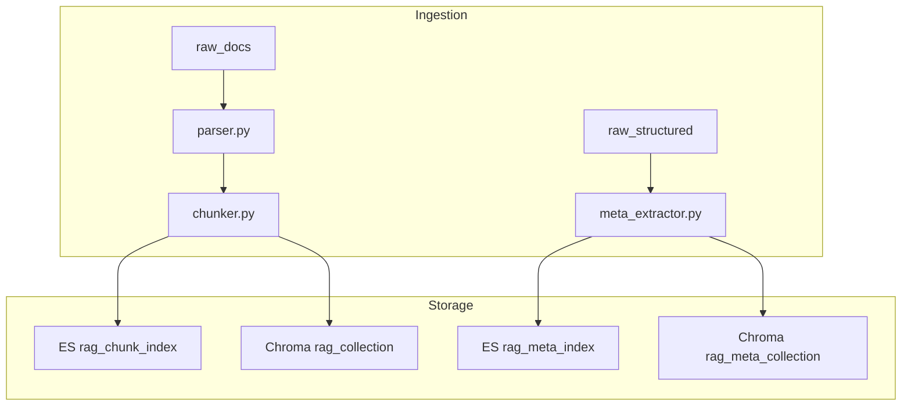
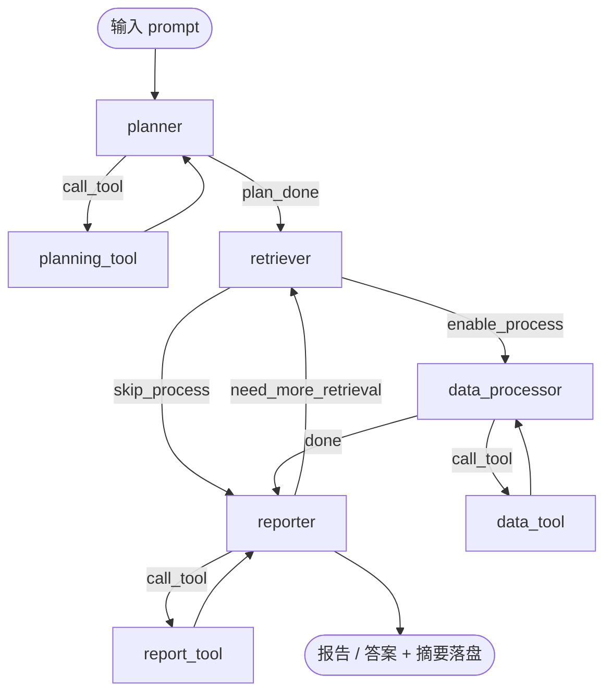
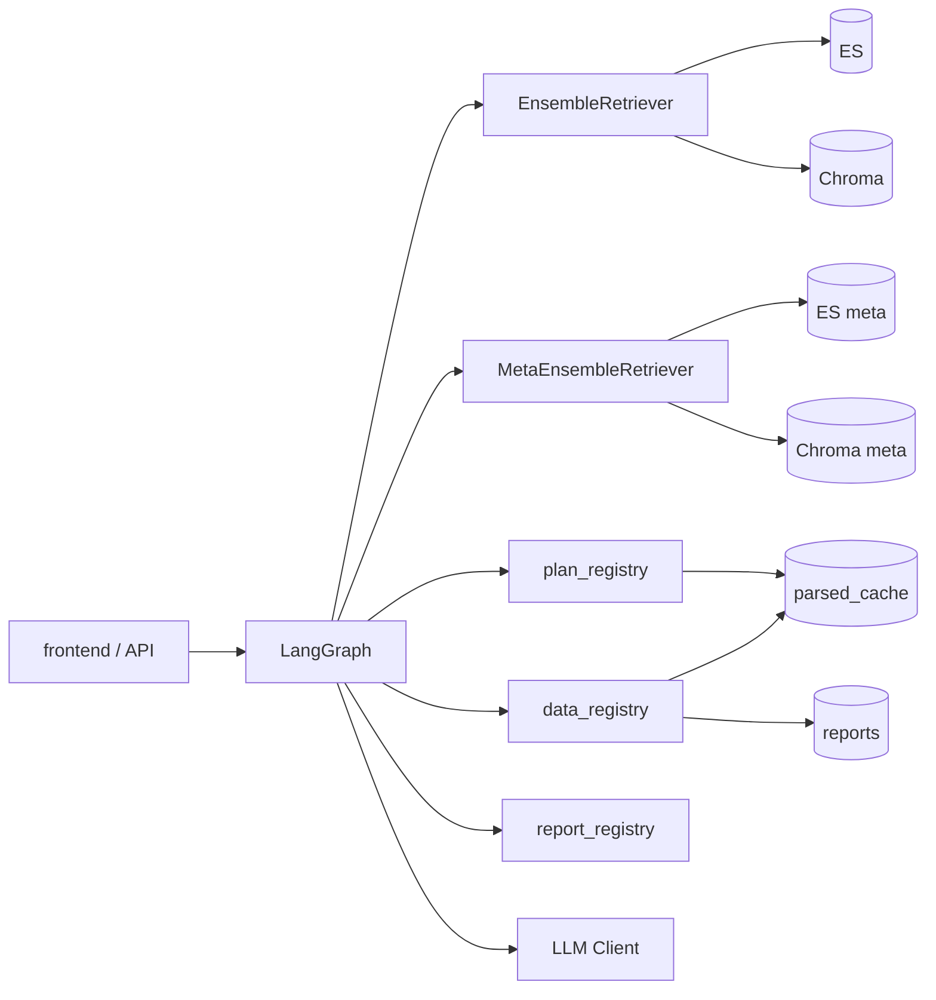

# Knowledge RAG System Agent

面向金融研报与结构化资金数据的企业知识库联合检索与报告系统。支持文本 RAG 问答、结构化数据按需处理（内置函数 / SQL / pandas / 绘图）、Markdown 报告生成与多轮追问。

---

## 前置准备

### 环境配置


| 组件            | 部署方式            | 说明                                                   |
| ------------- | --------------- | ---------------------------------------------------- |
| Elasticsearch | Docker          | 文本 chunk 与结构化元数据索引                                   |
| ChromaDB      | Docker（推荐 HTTP） | 向量检索；默认 `ghcr.io/chroma-core/chroma:0.5.4`，端口 `8001` |
| Redis         | Docker（可选）      | 缓存                                                   |
| Python 运行时    | Poetry          | `poetry lock` 锁定依赖                                   |


> Chroma 建议通过 Docker HTTP 模式运行（`.env` 中 `CHROMA_USE_HTTP=true`），避免 Windows 本地 HNSW 崩溃。Docker Hub 拉取超时时可使用 GHCR 镜像（见 `docker-compose.yml`）。

### 数据入库


| 知识库类型      | 源格式                  | 入库内容                | 检索结果           |
| ---------- | -------------------- | ------------------- | -------------- |
| **文本知识库**  | PDF / Word / TXT     | 语义分块；可选拼接标题摘要 chunk | `DocChunk` 文本块 |
| **结构化知识库** | CSV / XLSX / Parquet | 仅元数据（标题、表头、列名、路径）   | 文件路径（运行时读表）    |


> 文本分块策略由评测模块（`eval/`）评估后确定。

---

## Agent 执行链路

**主链路：** 输入 → 规划 → 双路检索 → 数据处理（含 `make_chart`）→ 输出报表 / 答案

系统包含 **3 个 LLM 节点**（`planner` / `data_processor` / `reporter`），各绑定一条 **LLM ↔ Tool** 循环；另有 1 个检索节点。

```
输入 prompt（+ 可选 session_id / chat_history）
    │
    ▼
┌─ planner ────────────────┐
│  LLM · 意图 / 链路规划    │◄──► planning_tool
└────────────┬─────────────┘
             ▼
       retriever（文本 chunk + 数据文件路径）
             │
             ▼
┌─ data_processor ─────────┐
│  LLM · 逐步数据处理       │◄──► data_tool（含 make_chart）
└────────────┬─────────────┘
             ▼
┌─ reporter ───────────────┐
│  LLM · 整合 + 写摘要      │◄──► report_tool
└────────────┬─────────────┘
             ├──► 二次 RAG（可选，回 retriever）
             ▼
       Markdown 报告 / 答案 + 会话摘要落盘
```

### 节点职责与 State


| 图节点                | 代码文件                      | 类型   | Tool 循环           | 主要 State 更新                                                                      |
| ------------------ | ------------------------- | ---- | ----------------- | -------------------------------------------------------------------------------- |
| **planner**        | `nodes/planner.py`        | LLM  | ↔ `planning_tool` | `node_flags`、`text_query`、`data_query`、`dataprocessplan`、`plan_context` |
| **planning_tool**  | `nodes/planning_tool.py`  | Tool | —                 | `plan_steps`                                                                     |
| **retriever**      | `nodes/retriever.py`      | -    | —                 | `knowledge_chunks`、`data_file_paths`                                             |
| **data_processor** | `nodes/data_processor.py` | LLM  | ↔ `data_tool`     | `intermediate_data_catalog`、`processed_data`、`chart_artifacts`、可选二次 query |
| **data_tool**      | `nodes/data_tool.py`      | Tool | —                 | 更新 `intermediate_data_catalog`、`chart_artifacts`、产物 `path`                      |
| **reporter**       | `nodes/reporter.py`       | LLM  | ↔ `report_tool`   | `report_artifact`、`final_answer`、会话摘要持久化                                         |
| **report_tool**    | `nodes/report_tool.py`    | Tool | —                 | `report_steps`、`report_context`                                                  |


### 会话与多轮追问


| 机制        | 说明                                                                                                                             |
| --------- | ------------------------------------------------------------------------------------------------------------------------------ |
| **摘要落盘**  | `reporter` 与正文同次 LLM 输出 `summary`，追加到 `{CACHE_PATH}/{session_id}/session_history.json` |
| **追问识别**  | `planner` 判断问题是否需结合前文；需要则调用 `load_history_context`，再结合历史填写 query |
| **历史加载**  | 问题需结合前文时 `planner` 调用 `load_history_context`（无入参），返回全部历史 Q&A 摘要写入 `plan_context.history_context` |
| **报告生成**  | `reporter` 单次 LLM 输出 JSON：`report`（正文/报告 Markdown）+ `summary`；报告模式写入 `report.md` |
| **客户端历史** | API 可选传 `chat_history`；无磁盘记录时 tool 回退到最近一轮 client 消息                                                                           |
| **新会话**   | API 传 `new_session: true`（前端「新会话」首条消息自动带上）时清空该 `session_id` 的 processed 目录与 `intermediate_data_catalog.json`              |


同一 `session_id` 的多轮请求会自动串联上下文，无需客户端自行拼摘要。

---

## LLM 节点与 Tool 绑定

每个 LLM 节点以 ReAct 循环运行：输出 JSON（`action=call_tool|done` 等），经统一 `pending_tool` 触发 Tool 节点，执行后清空 `pending_tool` 并回环，直至 `done` 进入下一图节点。

- **planner / reporter**：纯 ReAct（观测 `*_steps` 历史）
- **data_processor**：ReAct + 高层 `dataprocessplan`；支持 `action=replan` 根据工具成功/失败动态调整目标

状态字段：`pending_tool`（`PendingToolCall`）、`plan_done` / `process_done` / `report_done`、`*_steps` 历史列表。

### planner → `plan_registry`（`app/core/tools/plan/`）

| Tool | 功能 | 入参 | 返回 |
| ---- | ---- | ---- | ---- |
| `load_history_context` | 加载本会话全部历史问题与回答摘要 | 无（节点自动注入 `session_id`） | `turn_count`、`history`（列表）、`context_text`（全部历史拼接） |

> `planning_tool` 节点会自动注入 `session_id`、`current_query`、`settings`、`chat_history`。

### data_processor → `data_registry`（`app/core/tools/data/`）

| Tool | 功能 | 入参 | 返回 |
| ---- | ---- | ---- | ---- |
| `preview_read` | 预览读取结构化文件（不落盘） | `file_path`（绝对路径） | `preview`（前 20 行记录列表） |
| `data_filter` | 按列条件筛选，全量读取后保存为原格式 | `file_path`、`column`、`op`（`eq`\|`contains`，默认 `eq`）、`value` | `path`（保存后的绝对路径） |
| `sql_execute` | DuckDB 只读 `SELECT`，结果落盘 | `file_path`、`sql` | `path`；失败时 `error` |
| `pandas_execute` | 执行 pandas 代码（预置 `df`/`pd`，结果赋给 `result` 或 `df`） | `file_path`、`code` | `path`；非 DataFrame 或异常时 `error` |
| `make_chart` | 绘制表格 / 折线 / 柱状图 | `file_path`、`chart_type`（`table`\|`line`\|`bar`）、`x_axis`、`y_axis`、`title` | `path` |

**中间数据落盘规则**

- 目录：`{CACHE_PATH}/{session_id}/processed/`
- 命名：`{原文件名}_processed{原后缀}`（如图表可为 `_processed.png` / `_processed.csv`）
- 全局目录：`{CACHE_PATH}/{session_id}/intermediate_data_catalog.json`，记录 `{路径: 处理描述}`
- `data_processor` LLM 每次须输出完整 `intermediate_data`；同一会话内后续问题会加载该目录并注入 prompt
- 新会话（API `new_session: true`）清空 processed 目录与 catalog

> `data_tool` 节点会自动注入 `session_id`、`settings`；可在 `params.artifact_description` 中标注本轮产物描述。

### reporter → `report_registry`（`app/core/tools/report/`）

| Tool | 功能 | 入参 | 返回 |
| ---- | ---- | ---- | ---- |
| `read_data_file` | 读取中间数据或产物文件全文 | `path`（绝对路径） | `content`、`path`、`char_count`；失败时 `error` |

步数上限：`MAX_PLAN_TOOL_STEPS`、`MAX_PROCESS_TOOL_STEPS`、`MAX_REPORT_TOOL_STEPS`。

---

## LLM 结点与提示词工程


| 节点                 | 功能                                                 | 预期输入                                                 | 预期输出                                                                                   |
| ------------------ | -------------------------------------------------- | ---------------------------------------------------- | -------------------------------------------------------------------------------------- |
| **planner**        | 判断新话题 / 追问；调用 plan tool；确定链路开关与 query；描述数据处理需求     | `user_query`、`session_id`、已执行 `plan_steps`           | JSON：`action`、`tool_name`/`enable`_*、`text_query`、`data_query`、`dataprocessplan` |
| **data_processor** | 按需求逐步调用 data tool；含 SQL / pandas / 绘图；支持 replan 动态重规划 | `dataprocessplan`、`data_file_paths`、`intermediate_data_catalog`、tool 历史 | JSON：`action`（含 `replan`）、`tool_name`、`params`、`intermediate_data`（路径→描述，须完整输出） |
| **reporter**       | 整合检索与处理结果；读取中间数据路径；生成回答 / 报告；写回答摘要      | 检索 chunk、`intermediate_data_catalog`、图表路径、`history_context`             | 回答正文 + `session_history` 摘要；报告模式写 `report.md`（可插入图表）                          |


---

## 功能概览


| 模块            | 能力                                                                        |
| ------------- | ------------------------------------------------------------------------- |
| **双轨入库**      | 文本 → ES + Chroma chunk；结构化 → 仅元数据索引；MD5 增量 + 软删除                          |
| **文本混合检索**    | ES / BM25 / Dense 并行 + Reranker；`ENABLE_ES/BM25/DENSE` 消融                 |
| **元数据检索**     | MetaKeyword + MetaDense；返回含 `file_path` 的 `ScoredMetaRecord`              |
| **Agent 流水线** | 7 图节点：3 LLM ReAct + 3 Tool 环 + 1 检索；`pending_tool` 统一调度 |
| **流式 SSE**   | `POST /search/stream`、`POST /report/stream` 推送思考、工具步骤与逐字回答 |
| **结构化处理**     | `data_processor` ↔ `data_tool`：读表 / 过滤 / 聚合 / SQL / pandas / `make_chart` |
| **报告与图表**     | `POST /report/stream` 或 `report_mode`；图表由 data tool 生成，reporter 插入 Markdown           |
| **多轮会话**      | 服务端 `session_history.json` + `load_history_context` 追问加载                  |
| **评测体系**      | `gen_testset.py`、`rag_metric_eval.py`                                     |
| **实时监听**      | `monitor.py` 监听 `raw_docs` + `raw_structured`                             |


---

## 目录结构

```
Knowledge_Rag_System_Agent/
├── app/
│   ├── main.py                         # FastAPI 入口、lifespan、启动时 sync_all / 挂载路由
│   ├── dependencies.py                 # DI 容器：检索器、工具注册表、LLM、LangGraph 编译
│   ├── config/
│   │   ├── settings.py                 # 环境变量、路径、检索开关与权重
│   │   └── paths.py                    # PROJECT_ROOT、跨平台路径归一化
│   ├── common/
│   │   └── logger.py                   # loguru 初始化与封装
│   ├── schemas/
│   │   ├── query.py                    # /search、/report 请求体与流式事件
│   │   ├── session.py                  # session_id、new_session 等会话字段
│   │   ├── document.py                 # 文档上传/元数据
│   │   ├── structured.py               # PendingToolCall、ProcessedDataRef、中间数据目录
│   │   └── metrics.py                  # 评测指标结构
│   ├── api/
│   │   ├── __init__.py                 # mount_routes：聚合子路由
│   │   ├── doc_api.py                  # /documents 上传、删除、触发索引同步
│   │   ├── search_api.py               # /search/stream SSE 知识问答（主 Agent 流）
│   │   └── report_api.py               # /report/stream SSE 报告模式
│   ├── core/
│   │   ├── agent/                      # ── LangGraph Agent 主链路 ──
│   │   │   ├── graph.py                # 7 节点 StateGraph 编译与条件边
│   │   │   ├── state.py                # AgentState、AgentRuntime、NodeFlags
│   │   │   ├── runner.py               # run_agent_stream：建图、加载 catalog、SSE 驱动
│   │   │   ├── events.py               # ProgressEmitter、invoke_llm_decision/report
│   │   │   ├── llm_capture.py          # CAPTURE_LLM_IO=1 时落盘 prompt/输出
│   │   │   ├── query_guard.py          # 查询长度与敏感词守卫
│   │   │   ├── prompts/
│   │   │   │   ├── planner_prompt.py       # 规划 LLM：是否检索/处理/报告、工具选择
│   │   │   │   ├── data_processor_prompt.py # 数据处理 LLM：步骤与 intermediate_data
│   │   │   │   └── reporter_prompt.py      # 报告 LLM：Markdown + summary JSON
│   │   │   └── nodes/
│   │   │       ├── planner.py              # 规划节点：解析 LLM JSON → pending_tool
│   │   │       ├── planning_tool.py          # 执行 plan 工具（load_history_context）
│   │   │       ├── retriever.py              # 双路检索编排入口
│   │   │       ├── retrieve_knowledge.py     # 知识库 chunk 检索（ES/BM25/Dense 融合）
│   │   │       ├── retrieve_data.py          # 结构化元数据检索（keyword + dense）
│   │   │       ├── data_processor.py         # 数据处理 LLM 决策循环
│   │   │       ├── data_tool.py              # 执行 data 工具并写 processed 产物
│   │   │       ├── reporter.py               # 报告 LLM 循环、持久化 session 轮次
│   │   │       ├── report_tool.py            # 执行 read_data_file 等 report 工具
│   │   │       ├── _routes.py                # 各节点后条件路由（phase → 下一节点）
│   │   │       ├── _helpers.py               # LLM JSON 解析、状态补丁
│   │   │       ├── _node_log.py              # 节点 INFO 结构化日志
│   │   │       └── _debug_runtime.py         # prompt_debug 脚本用 sample_state
│   │   ├── session/                    # ── 会话持久化 ──
│   │   │   ├── history_store.py            # parsed_cache/{id}/session_history.json
│   │   │   └── process_artifact_store.py   # intermediate_data_catalog + processed/ 路径
│   │   ├── tools/                      # ── 可调用工具（7 个）──
│   │   │   ├── registry.py                   # plan/data/report 三套 ToolRegistry
│   │   │   ├── base_tool.py                  # BaseTool 抽象与 execute 约定
│   │   │   ├── structured_ops.py             # read_table / write_table 等表 IO
│   │   │   ├── artifact_utils.py             # processed 文件命名与落盘路径
│   │   │   ├── plan/
│   │   │   │   └── load_history_context.py   # 加载会话 history + context_text
│   │   │   ├── data/
│   │   │   │   ├── preview_read.py           # 预览原始表，不落盘
│   │   │   │   ├── data_filter.py            # 条件过滤 → processed
│   │   │   │   ├── sql_execute.py            # DuckDB SQL → processed
│   │   │   │   ├── pandas_execute.py         # pandas 代码 → processed
│   │   │   │   ├── make_chart.py             # 图表工具入口
│   │   │   │   └── chart_render.py           # matplotlib 渲染 PNG
│   │   │   └── report/
│   │   │       └── read_data_file.py         # 读取 processed/报告文件全文
│   │   ├── retrieval/                  # ── 检索与重排 ──
│   │   │   ├── base.py                       # Retriever 协议
│   │   │   ├── es_retriever.py               # Elasticsearch 全文
│   │   │   ├── bm25_retriever.py             # 内存 BM25
│   │   │   ├── dense_retriever.py            # Chroma 向量 chunk 检索
│   │   │   ├── ensemble.py                   # 多路 chunk 分数融合
│   │   │   ├── meta_keyword_retriever.py     # 结构化表名/字段 keyword
│   │   │   ├── meta_dense_retriever.py       # 结构化元数据向量检索
│   │   │   ├── meta_ensemble.py              # 元数据双路融合
│   │   │   ├── reranker.py                   # bge-reranker 交叉编码重排
│   │   │   └── score_filter.py               # 分数阈值过滤
│   │   └── ingestion/                  # ── 入库流水线 ──
│   │       ├── parser.py                     # PDF/文本解析
│   │       ├── chunker.py                    # 文本分块
│   │       ├── meta_extractor.py             # CSV 等结构化元数据抽取
│   │       └── updater.py                    # 监听目录 → ES + Chroma 增量同步
│   └── infrastructure/                 # ── 外部服务客户端 ──
│       ├── es_client.py                      # Elasticsearch 封装
│       ├── vector_client.py                  # Chroma HTTP / 本地持久化
│       ├── embedding_service.py              # bge-m3 向量化
│       ├── llm_client.py                     # OpenAI 兼容 LLM 流式调用
│       ├── hf_hub_config.py                  # HF_HOME / 镜像配置
│       ├── chroma_bootstrap.py               # Chroma collection 初始化
│       ├── chroma_lock.py                    # 本地 Chroma 文件锁
│       └── chroma_telemetry.py               # 关闭 Chroma 遥测
├── scripts/
│   ├── monitor.py                      # watchdog 监听 raw_docs + raw_structured → sync
│   ├── run_query_capture_llm.py        # E2E 跑一条 query 并捕获 LLM I/O
│   ├── score_chunk_query.py            # 单 query chunk 打分调试
│   ├── reset_chroma_chunks.py          # 清空 Chroma chunk collection
│   ├── test_chroma_upsert.py           # Chroma 写入冒烟
│   ├── check_es_health.py              # ES 连通检查
│   ├── check_chroma_import.py          # Chroma 依赖检查
│   ├── check_hf_hub.py                 # HuggingFace 模型缓存检查
│   ├── check_docker_registry.py        # Docker 镜像源检查
│   └── prompt_debug/                   # 不启 FastAPI，单节点 LLM 调试
│       ├── common.py                       # 输出到 debug_output/、拼 prompt
│       ├── run_planner.py
│       ├── run_data_processor.py
│       ├── run_reporter.py
│       └── samples/                        # 各节点默认 state JSON
│           ├── planner_default.json
│           ├── data_processor_default.json
│           └── reporter_default.json
├── eval/
│   ├── gen_testset.py                  # 生成评测集
│   └── rag_metric_eval.py              # RAG 指标评测
├── frontend/
│   └── index.html                      # 简易 SSE 聊天/报告前端
├── data/                               # ── 数据目录（运行时本地生成）──
│   ├── raw_docs/                       # 文本/PDF 源（.gitignore，仅本地）
│   ├── raw_structured/                 # CSV 等结构化源（.gitignore，仅本地）
│   ├── parsed_cache/{session_id}/      # 会话工作区（.gitignore）
│   │   ├── session_history.json            # 多轮问答摘要
│   │   ├── intermediate_data_catalog.json  # 中间数据 path → 说明
│   │   └── processed/                    # 工具产物 *_processed.{csv,json,png}
│   ├── persist_db/                     # Chroma 向量持久化（.gitignore）
│   ├── hf_cache/                       # HuggingFace 模型缓存（.gitignore）
│   └── reports/{session_id}/           # report.md + 图表（.gitignore）
├── logs/                               # 应用日志（.gitignore）
├── debug_output/                       # prompt_debug / LLM capture（.gitignore）
│   └── llm_io/                         # CAPTURE_LLM_IO 落盘 .md/.json
├── eval/test_result/                   # 评测输出（.gitignore）
├── docker-compose.yml                  # ES + Chroma 本地编排
├── pyproject.toml                      # Poetry 依赖与脚本入口
├── .env.example                        # 环境变量模板
└── template.py                         # 财务指标计算函数样例（未接入 registry）
```

---

## 技术栈与版本


| 类别        | 选型                             | 版本               |
| --------- | ------------------------------ | ---------------- |
| 运行时       | Python                         | >=3.11,<3.13     |
| Web       | FastAPI + Uvicorn              | 0.109.2 / 0.27.1 |
| Agent     | LangGraph + LangChain          | 0.2.27 / 0.2.10  |
| 检索        | Elasticsearch + ChromaDB       | 8.13.0 / 0.5.4   |
| Embedding | sentence-transformers + bge-m3 | 3.3.1            |
| 结构化       | pandas + duckdb                | 2.2.3 / 1.1.3    |
| 图表        | matplotlib                     | 3.9.4            |


---

## 快速开始

### 1. 安装

```bash
poetry install
cp .env.example .env
# 填写 LLM_API_KEY；确认 CHROMA_USE_HTTP=true
```

### 2. 启动基础设施

```bash
docker compose up -d
docker compose ps
# ES:  curl -u elastic:elastic123 http://127.0.0.1:9200
# Chroma HTTP: 127.0.0.1:8001
```

### 3. 启动 API

```bash
poetry run uvicorn app.main:app --reload --host 0.0.0.0 --port 8000
# 可选增量入库
poetry run python scripts/monitor.py
```

### 4. 访问

- Swagger：`http://localhost:8000/docs`
- 前端：`frontend/index.html`

---

## 主要环境变量


| 变量                                                          | 说明                         | 默认                            |
| ----------------------------------------------------------- | -------------------------- | ----------------------------- |
| `LLM_BASE_URL` / `LLM_API_KEY` / `LLM_MODEL`                | LLM 配置                     | —                             |
| `ES_HOST` / `ES_USER` / `ES_PASSWORD`                       | Elasticsearch              | 对齐 compose                    |
| `CHROMA_USE_HTTP` / `CHROMA_HTTP_HOST` / `CHROMA_HTTP_PORT` | Chroma Docker HTTP         | `true` / `127.0.0.1` / `8001` |
| `CACHE_PATH`                                                | 解析缓存 + **会话历史**            | `./data/parsed_cache`         |
| `REPORT_OUTPUT_PATH`                                        | 报告与图表                      | `./data/reports`              |
| `MAX_PLAN_TOOL_STEPS`                                       | planner ↔ planning_tool    | `1`                           |
| `MAX_PROCESS_TOOL_STEPS`                                    | data_processor ↔ data_tool | `5`                           |
| `MAX_REPORT_TOOL_STEPS`                                     | reporter ↔ report_tool     | `5`                           |
| `MAX_RETRIEVAL_ROUNDS`                                      | reporter 二次检索上限            | `3`                           |
| `CONTEXT_SIZE_THRESHOLD_CHARS`                              | read_data_file 默认截断        | `12000`                       |
| `ENABLE_ES` / `ENABLE_BM25` / `ENABLE_DENSE`                | 文本检索消融                     | 均为 `true`                     |
| `ENABLE_AGENT_NODE_LOG` / `AGENT_NODE_LOG_LEVEL`            | Agent 节点全流程日志（START/END/关键步骤） | `true` / `INFO`                 |


完整列表见 `.env.example`。

---

---

## API 概览


| 路由  | 路径                                                 | 说明                                                |
| --- | -------------------------------------------------- | ------------------------------------------------- |
| 文档  | `POST /documents/upload`、`POST /documents/sync`    | 上传与全量同步                                           |
| 问答  | `POST /search/stream`（SSE）                         | `query`、`session_id`、`chat_history`、`report_mode` |
| 报告  | `POST /report/stream`（SSE）、`GET /report/{session_id}/download` | 流式生成与 Markdown 下载 |


### SSE 事件类型

| type | 说明 |
|------|------|
| `node_start` | 进入图节点（如 retriever） |
| `thinking_start` / `thinking_delta` / `thinking_end` | 三阶段 LLM 决策流式输出 |
| `tool_start` / `tool_end` | 工具调用中 / 完成 |
| `answer_start` / `answer_delta` / `answer_end` | 最终回答逐字流 |
| `done` | 含 `answer`、`session_id`、`report_url`、检索结果等 |
| `error` | 异常信息 |

前端见 `frontend/index.html`（思考区可折叠、工具步骤、回答流式展示）。

**SearchRequest 示例：**

```json
{
  "query": "汇总最近销售数据并画柱状图",
  "session_id": "demo-session-001",
  "report_mode": false,
  "chat_history": [
    {"role": "user", "content": "上一问..."},
    {"role": "assistant", "content": "上一答..."}
  ]
}
```

---

## 脚本与评测手册

均在**仓库根目录**执行。依赖 `.env` 与 `poetry install` 已完成。

| 脚本 | 用途分类 | 测试/使用目的 |
|------|----------|----------------|
| `scripts/monitor.py` | 入库运维 | 监听 `raw_docs` / `raw_structured` 变更并增量同步到 ES + Chroma |
| `scripts/run_query_capture_llm.py` | Agent E2E | 不启 FastAPI，跑完整 Agent 并落盘全部 LLM prompt/输出 |
| `scripts/prompt_debug/run_planner.py` | Prompt 单测 | 隔离调试 planner 提示词与 LLM 响应 |
| `scripts/prompt_debug/run_data_processor.py` | Prompt 单测 | 隔离调试 data_processor 提示词 |
| `scripts/prompt_debug/run_reporter.py` | Prompt 单测 | 隔离调试 reporter 决策/成稿提示词 |
| `scripts/score_chunk_query.py` | 检索调试 | 计算 query 与 chunk 的余弦相似度（可选 rerank） |
| `scripts/check_es_health.py` | 基础设施 | 探测 Elasticsearch 连通与鉴权 |
| `scripts/check_chroma_import.py` | 基础设施 | 验证 Chroma / onnxruntime 能否正常 import |
| `scripts/check_hf_hub.py` | 基础设施 | 验证 HF 镜像可达性与 bge 模型元数据 |
| `scripts/check_docker_registry.py` | 基础设施 | 探测 Docker Hub / elastic 镜像仓库 TCP 连通 |
| `scripts/reset_chroma_chunks.py` | Chroma 维护 | 重建 `rag_collection` 并 smoke upsert（upsert 卡死/损坏恢复） |
| `scripts/test_chroma_upsert.py` | Chroma 维护 | 批量 upsert 压测/诊断（建议停 uvicorn 后跑） |
| `eval/gen_testset.py` | RAG 评测 | 从 `raw_docs` 用 LLM 自动生成问答评测集 |
| `eval/rag_metric_eval.py` | RAG 评测 | 对评测集跑 ES/BM25/Dense 消融并算 Recall@K |

---

### 1. 入库监听 — `scripts/monitor.py`

**目的**：开发/运维时自动增量入库，无需手动调 `/documents/sync`。

```bash
poetry run python scripts/monitor.py
```

- 启动时先执行一次全量 `sync_all`
- 用 watchdog 监听 `data/raw_docs`、`data/raw_structured`（debounce 2s）
- 支持 PDF/文本与 CSV 等结构化扩展名
- `Ctrl+C` 退出

---

### 2. Agent 端到端 + LLM 捕获 — `scripts/run_query_capture_llm.py`

**目的**：调试完整 LangGraph 链路，记录 planner / data_processor / reporter 每次 LLM 的 prompt 与原始输出。

```bash
# 修改脚本内 QUERY 变量后执行
poetry run python scripts/run_query_capture_llm.py
```

- 自动设置 `CAPTURE_LLM_IO=1`，`new_session=True`
- 输出目录：`debug_output/llm_io/{时间戳}_{query}.md` 与同名的 `.json`
- 需 LLM、ES、Chroma 可用；首次检索会加载 bge-m3（依赖 `HF_ENDPOINT` / 本地缓存）

---

### 3. 单节点 Prompt 调试 — `scripts/prompt_debug/`

**目的**：不启动 FastAPI、不跑全图，仅用与线上一致的 `app/core/agent/prompts/` 构建 prompt，调用 LLM 并将结果写入 `debug_output/`。

**公共参数**（三个 run_*.py 均支持）：

| 参数 | 说明 |
|------|------|
| `--query` | 覆盖 state 中的 `user_query` |
| `--state` | JSON state 文件路径（见 `samples/`） |
| `--out` | 输出 markdown 路径（默认带时间戳文件名） |

**样例 state**：`scripts/prompt_debug/samples/planner_default.json`、`data_processor_default.json`、`reporter_default.json`

#### planner

```bash
poetry run python -m scripts.prompt_debug.run_planner --query "分析某公司营收"
poetry run python -m scripts.prompt_debug.run_planner --state scripts/prompt_debug/samples/planner_default.json
```

**测试目的**：验证入口校验、enable_* 开关、dataprocessplan、会话历史数据目录等 planner 规则是否符合预期。

#### data_processor

```bash
poetry run python -m scripts.prompt_debug.run_data_processor --query "统计前10名并画图"
poetry run python -m scripts.prompt_debug.run_data_processor --state scripts/prompt_debug/samples/data_processor_default.json
```

**测试目的**：验证 dataprocessplan + 工具调用历史 + 可调用工具说明下的下一步决策（call_tool / done / replan）。

#### reporter

```bash
poetry run python -m scripts.prompt_debug.run_reporter --mode both
poetry run python -m scripts.prompt_debug.run_reporter --mode decision --query "汇总龙虎榜"
poetry run python -m scripts.prompt_debug.run_reporter --mode answer --state scripts/prompt_debug/samples/reporter_default.json
```

| `--mode` | 说明 |
|----------|------|
| `decision` | 仅跑报告决策 prompt（call_tool / need_retrieval / done） |
| `answer` | 仅跑最终成稿 prompt（report + summary JSON） |
| `both` | 两者依次执行（默认） |

**测试目的**：验证中间数据 catalog、图表路径、read_data_file 决策与 Markdown 成稿质量。

---

### 4. 检索打分 — `scripts/score_chunk_query.py`

**目的**：离线验证 embedding 相似度与 `MIN_RETRIEVAL_SCORE` 阈值，不经过 ES/Chroma。

```bash
poetry run python scripts/score_chunk_query.py --query "龙虎榜" --chunk "金融产业"
poetry run python scripts/score_chunk_query.py --query "..." --chunk-file path/to/text.txt
poetry run python scripts/score_chunk_query.py --query "..." --chunks-json chunks.json --rerank
poetry run python scripts/score_chunk_query.py --query "..." --chunk "..." --out scores.json
```

| 参数 | 说明 |
|------|------|
| `--query` | 检索问句 |
| `--chunk` / `--chunk-file` | 单条 chunk 文本 |
| `--chunks-json` | 批量：`[{"text":"..."}, ...]` |
| `--rerank` | 额外计算 cross-encoder rerank 分 |
| `--out` | 可选 JSON 输出路径 |

---

### 5. 基础设施诊断 — `scripts/check_*.py`

**目的**：部署/联网问题排查，结果追加写入仓库根目录 `debug-72ff74.log`（NDJSON）。

```bash
poetry run python scripts/check_es_health.py      # ES HTTP + 鉴权
poetry run python scripts/check_chroma_import.py  # chromadb / onnxruntime import
poetry run python scripts/check_hf_hub.py         # HF 镜像 TCP + 模型 HEAD 请求
poetry run python scripts/check_docker_registry.py # Docker Hub / docker.elastic.co 443
```

| 脚本 | 测试目的 |
|------|----------|
| `check_es_health.py` | 确认 ES 地址、用户名密码、集群是否可达 |
| `check_chroma_import.py` | 排除 Chroma 因 onnx 依赖导致的 import 失败 |
| `check_hf_hub.py` | 确认 `HF_ENDPOINT` 镜像与 bge-m3 模型元数据可拉取 |
| `check_docker_registry.py` | 确认本机能否拉取 compose 所需 Docker 镜像 |

---

### 6. Chroma 维护 — `scripts/reset_chroma_chunks.py` / `test_chroma_upsert.py`

**目的**：向量库异常（upsert  hang、collection 损坏、锁冲突）时的恢复与写入性能验证。

```bash
# 删除并重建 rag_collection，写入一条 smoke 向量，并清理 parsed_cache 顶层 *.json
poetry run python scripts/reset_chroma_chunks.py

# 默认 upsert 8 条诊断向量（使用 .env 中的 Chroma 配置）
poetry run python scripts/test_chroma_upsert.py
poetry run python scripts/test_chroma_upsert.py 32          # 指定条数
poetry run python scripts/test_chroma_upsert.py 8 --temp    # 隔离目录 data/chroma_diag_tmp
```

> 建议在**停止 uvicorn** 后执行，避免与运行中服务争用 Chroma 文件锁或 HTTP 连接。

---

### 7. RAG 消融评测 — `eval/`

**目的**：自动生成评测集，对比 ES-only / BM25-only / Dense-only / 混合检索的 Recall@K。

```bash
# 1. 扫描 data/raw_docs，每篇 PDF/文本生成 3 条 QA → eval/test_result/testset_*.json
poetry run python eval/gen_testset.py

# 2. 读取最新 testset，跑四种 scheme → eval/test_result/metrics_*.json
poetry run python eval/rag_metric_eval.py
```

| 脚本 | 输入 | 输出 |
|------|------|------|
| `gen_testset.py` | `data/raw_docs` 文本文件 | `eval/test_result/testset_{timestamp}.json` |
| `rag_metric_eval.py` | 上述最新 testset | `eval/test_result/metrics_{timestamp}.json` |

`rag_metric_eval.py` 内置 scheme：`full_hybrid`、`es_only`、`bm25_only`、`dense_only`（由 `ENABLE_ES` / `ENABLE_BM25` / `ENABLE_DENSE` 组合切换）。

---

## 架构示意

### 双轨入库




### LangGraph Agent（7 节点）




### 端到端请求流




---

## Agent 节点 INFO 日志说明

默认开启全流程 INFO 日志（`ENABLE_AGENT_NODE_LOG=true`，`AGENT_NODE_LOG_LEVEL=INFO`）。控制台与 `logs/` 目录输出格式为：

`[agent][{节点名}] {说明} key=value ...`

| 日志说明 | 阶段 | 节点 | 附带字段（示例） |
| --- | --- | --- | --- |
| 进入规划节点 | START | **planner** | `session_id`、`query`、`plan_step`、`max_steps`、`history_loaded` |
| 正在规划链路开关与 query | INFO | planner | `user_query` |
| 规划步数已达上限，使用兜底 enables | INFO | planner | `enables`（knowledge/data/process/chart/report） |
| LLM 规划解析完成 | INFO | planner | `action`、`method`、`enables` |
| LLM 规划 JSON 解析失败，使用规则兜底 | INFO | planner | `error` |
| 本次规划链路 | INFO | planner | `enables`、`text_query`、`data_query`、`dataprocessplan` |
| 初始化 session 与步数上限 | INFO | planner | `session_id` |
| 触发 plan tool 调用 | INFO | planner | `method`、`params` |
| 生成 query 成功 | INFO | planner | `text_query`、`data_query` |
| 规划结束 | END | planner | `plan_done`、`text_query`、`data_query`、`enables`；转 tool 时含 `next_node=planning_tool`、`method` |
| 进入规划工具节点 | START | **planning_tool** | `method`、`step`、`params`；无任务时为 `plan_action=skip` |
| 无待执行 plan tool，跳过 | INFO | planning_tool | — |
| 触发 plan tool 调用 | INFO | planning_tool | `method` |
| plan tool 调用成功 | INFO | planning_tool | `method`、`result` |
| 工具执行结束 | END | planning_tool | `method`、`step`、`success`、`next_node=planner` |
| 进入检索编排节点 | START | **retriever** | `text_query`、`data_query`、`knowledge`、`data`（是否启用） |
| 并行执行知识检索与元数据检索 | INFO | retriever | — |
| 检索汇总 | INFO | retriever | `knowledge_chunks`、`data_files` |
| 检索结束 | END | retriever | `knowledge_chunks`、`data_files` |
| 进入文档检索 | START | **retrieve_knowledge** | `query`、`enabled`；未启用时 `enabled=false` |
| 知识检索未启用，跳过 | INFO | retrieve_knowledge | — |
| 正在查询文档 | INFO | retrieve_knowledge | `query` |
| 文档检索完成 | INFO | retrieve_knowledge | `count` |
| 检索结束 | END | retrieve_knowledge | `count`、`query`；跳过时 `skipped=true` |
| 进入元数据检索 | START | **retrieve_data** | `query`、`enabled` |
| 结构化数据检索未启用，跳过 | INFO | retrieve_data | — |
| 正在检索结构化元数据 | INFO | retrieve_data | `query` |
| 元数据检索完成 | INFO | retrieve_data | `hit_count`、`file_paths` |
| 检索结束 | END | retrieve_data | `hit_count`、`paths` |
| 进入数据处理决策 | START | **data_processor** | `file_path`、`process_step`、`max_steps`、`prior_tool_steps` |
| 数据处理未启用，跳过 | INFO | data_processor | — |
| 无可用数据文件，跳过处理 | INFO | data_processor | — |
| 命中缓存的处理结果 | INFO | data_processor | `path` |
| 数据处理步数已达上限，结束 | INFO | data_processor | `max_steps` |
| LLM 数据处理决策 | INFO | data_processor | `action`、`tool_name` |
| LLM JSON 解析失败，使用兜底 | INFO | data_processor | `error` |
| 触发 data tool 调用 | INFO | data_processor | `tool_name`、`params` |
| 决策结束 | END | data_processor | `process_done`、`next_node=data_tool`、`tool_name`；完成时含 `tool_steps` |
| 进入数据工具执行 | START | **data_tool** | `tool_name`、`step`、`file_path`、`params` |
| 无待执行 data tool，跳过 | INFO | data_tool | — |
| 触发 data tool 调用 | INFO | data_tool | `tool_name` |
| 图表生成成功 | INFO | data_tool | `path`、`chart_type` |
| 执行成功，已保存 artifact | INFO | data_tool | `path`（sql_execute / pandas_execute） |
| 工具调用成功 | INFO | data_tool | `tool_name`、`artifact` |
| 工具执行结束 | END | data_tool | `tool_name`、`step`、`success`、`next_node=data_processor` |
| 进入报告/回答节点 | START | **reporter** | `session_id`、`query`、`knowledge_chunks`、`meta_hits`、`report_step`、`retrieval_round` |
| 上下文不足，触发补充检索 | INFO | reporter | `round` |
| 无法查询到目标数据 | INFO | reporter | — |
| LLM 报告决策 | INFO | reporter | `action`、`tool_name` |
| LLM JSON 解析失败，直接生成回答 | INFO | reporter | `error` |
| 触发补充检索 | INFO | reporter | `text_query`、`data_query` |
| 触发 report tool 调用 | INFO | reporter | `tool_name`、`params` |
| 正在生成最终回答 | INFO | reporter | `report_mode` |
| Markdown 报告已写入 | INFO | reporter | `path` |
| 回答生成成功 | INFO | reporter | `answer_len` |
| 报告/回答结束 | END | reporter | `report_done`、`status`、`answer_len`；报告模式含 `markdown_path`；补充检索时 `need_more_retrieval=true` |
| 进入报告工具执行 | START | **report_tool** | `tool_name`、`step`、`params` |
| 无待执行 report tool，跳过 | INFO | report_tool | — |
| 触发 report tool 调用 | INFO | report_tool | `tool_name` |
| report tool 调用成功 | INFO | report_tool | `tool_name`、`path` |
| 工具执行结束 | END | report_tool | `tool_name`、`step`、`success`、`next_node=reporter` |

> `AGENT_NODE_LOG_LEVEL=ERROR` 时仅输出失败路径（`fail()`，如 tool 调用失败/异常/未找到）；`DEBUG` 在 INFO 基础上额外输出 LLM 调用细节；`OFF` 或 `ENABLE_AGENT_NODE_LOG=false` 关闭全部节点日志。
